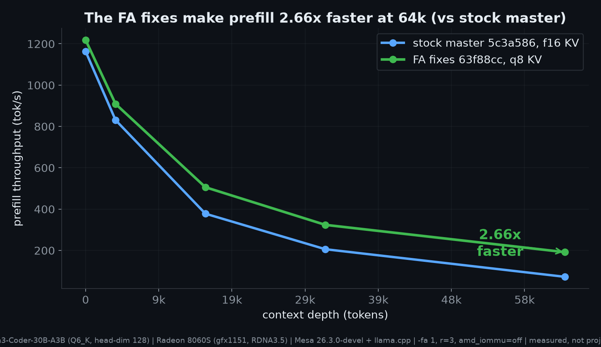
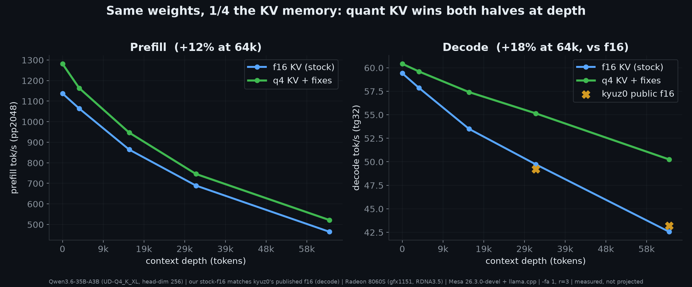
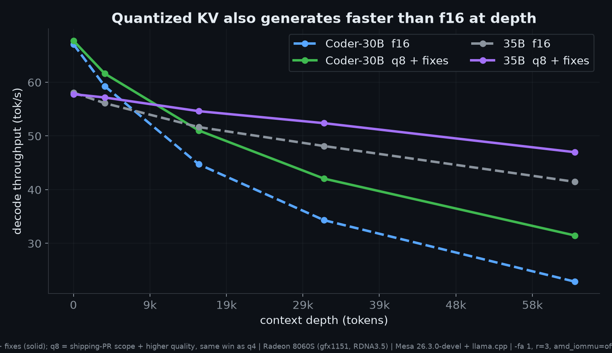
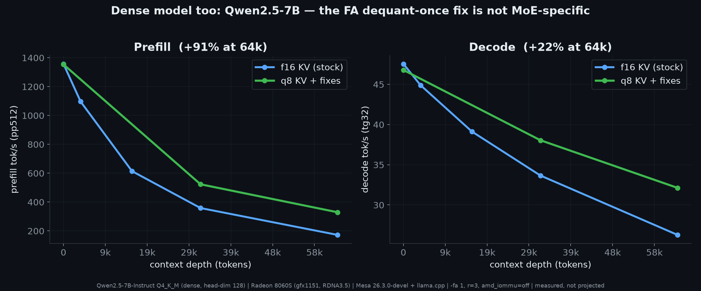

# Strix Halo llama.cpp toolbox (FA + MoE-prefill fixes)

A ready-to-run llama.cpp for AMD Strix Halo (Ryzen AI Max+ 395 / Radeon 8060S / gfx1151),
tuned for **long-context, quantized-KV** workloads. It bundles a set of Flash-Attention and
MoE-prefill fixes plus a current GPU driver, so quantized KV cache is fast instead of a penalty.

The measurements behind these fixes (matrices, methodology, raw data) live in the companion
[evidence pack](benchmarks/BENCHMARKS.md).

## Speedups at a glance

**q8 KV + fixes vs stock f16** (this box, `amd_iommu=off`, pp512 / tg32 t/s, measured). The fix doesn't speed up
short prompts — at d0 quantized KV ≈ f16 (nothing to dequantize yet). Its value is at **depth**, where stock f16
collapses while quantized KV stays fast, so the win grows with context:

| Model (arch) | Prefill d0 | Prefill 64k | Decode d0 | Decode 64k |
|---|---:|---:|---:|---:|
| Qwen3-Coder-30B-A3B-Instruct (Q6_K_XL, hd128 MoE) | 1218 | **191 = 2.66x** | 68 | **32 = +38%** |
| Qwen3.6-35B-A3B (Q4_K_XL, hd256 MoE) | 1368 | 537 = **+9%** | 60 | 49 = **+15%** |
| Qwen2.5-7B-Instruct (Q4_K_M, hd128 dense) | 1353 | 329 = **+91%** | 47 | 32 = **+22%** |

Values are q8 KV + fixes; the ×/% is vs stock f16 **at that depth**. At d0 it's ~parity (~1.0x) — every win is at
depth: e.g. Coder-30B prefill, stock f16 collapses to **72 t/s** @64k while ours holds **191**. (q4 KV gives a
little more decode at 1/4 the KV memory — see the charts.)

**What each fix contributes:**

| Fix / knob | Backend | Contribution |
|---|---|---|
| FA dequant-once (#25494) | Vulkan | **the 2.66x** — dequantize q8 KV once in the FA kernel (prefill) |
| all-quant transpose | Vulkan | extends it to q4/q5 KV (q4 lands the same 2.64x) |
| mmid row-list prepass | Vulkan | **+8.4%** MoE prefill (model-dependent; ~1–2% on Coder at depth) |
| mmid BM64 | Vulkan | +1.3% (small waste-removal). The scale-cache that used to sit here is disabled: it was obsoleted by later tile changes and regressed. |
| mmid WAVE32 / F16B | Vulkan | +2.8% / +2.4% (tweaks; F16B on by default) |
| mmid TILE16 / INT | Vulkan | −3.8% / −8.5% (documented negatives, never enabled) |
| HIP tile-dequant KV | HIP/ROCm | **+128% / +232%** decode @32k / 64k (beats f16) |
| `amd_iommu=off` | host | ~+3–5% prefill (optional host tuning) |

Honest read: on Coder the **FA dequant-once fix is essentially the entire prefill win**; `rowlists` is the
real MoE-prefill fix (larger on other shapes); the rest are small waste-removals and the knob-tweaks are
marginal-to-negative — as expected on a bandwidth-bound kernel. Full per-depth matrices + charts are below
and in [benchmarks/BENCHMARKS.md](benchmarks/BENCHMARKS.md).

## What's inside

- **`vulkan/`** self-contained Vulkan/RADV build (recommended default backend on this hardware).
  Bundles **Mesa 26.3.0-devel RADV** + **libdrm 2.4.133**, so it does not use or need the host
  Mesa. Runs directly on the host with just the Vulkan loader and `/dev/dri`.
- **`hip/`** ROCm/HIP build carrying the quantized-KV decode fix. Needs the ROCm runtime, so it
  ships as a container image (`Dockerfile.hip`).

## Getting the binaries

Three ways — the first two need **no build and no Docker**:

**1. Portable tarball (recommended for a quick start).** Self-contained — bundles the RADV driver, so it
doesn't use the host's Mesa; only needs `libvulkan1` + read access to `/dev/dri`:
```
curl -L https://github.com/Nathanw1014/strix-halo-llamacpp/releases/download/v0.1/strix-halo-llamacpp-vulkan-portable.tar.gz | tar xz
./vulkan/llama-server -m /path/to/MODEL.gguf -ngl 99 -fa 1 -ctk q8_0 -ctv q8_0 --host 0.0.0.0
```

**2. Container.** `docker pull ghcr.io/nathanw1014/strix-halo-llamacpp:vulkan` (see [Quickstart](#quickstart)).

**3. Build from source.** Build the **`strix-halo-vulkan`** branch of the
[fork](https://github.com/Nathanw1014/llama.cpp) (the complete Vulkan stack) — see **[BUILD.md](BUILD.md)**
for the exact toolchain; `build-from-source.sh` then assembles the built binaries + driver into this layout.

The tarball (32 MB) and container images are shipped via GitHub Releases / ghcr, not tracked in git.

## The fixes

- **Vulkan: dequantize KV once in the FA kernel (prefill).** Quantized KV was re-dequantized on
  every FA pass; now it is dequantized once into a transposed scratch and reused. This is what
  makes quantized-KV **prefill** fast at depth (up to 2.66x f16 on head-dim-128 models).
- **Vulkan: mmid row-list prepass (MoE prefill).** Removes the redundant per-workgroup expert-ID
  scan in `MUL_MAT_ID`. Model-dependent: large on some MoEs, small on others.
- **HIP: dequantize KV on load in the tile FA kernel (decode).** Routes quantized decode through
  the tile kernel (dequant once, batched across GQA heads) instead of the vec kernel that repeats
  the dequant per query head. Fixes quantized-KV **decode** at depth on ROCm.

## Branches (upstreaming)

Each fix is kept on its own clean, minimal branch of the llama.cpp fork so it can be reviewed and
upstreamed independently. This toolbox stacks all of them.

| Branch | Fix | Status |
|---|---|---|
| `vulkan-coopmat1-fa-dequant-transpose` | Vulkan FA dequant-once (prefill) | in-flight PR #25494 |
| [`vulkan-mmid-rowlists`](https://github.com/Nathanw1014/llama.cpp/tree/vulkan-mmid-rowlists) | mmid row-list prepass (MoE prefill) | upstream candidate, pushed |
| `fa-tile-dequant-on-load` | HIP tile-dequant (quantized-KV decode) | public branch, testable |

Full inventory (combined + experimental branches) and the honest **fixes vs config-tweaks** taxonomy
(one real fix, the rest marginal knobs): **[BRANCHES.md](BRANCHES.md)**.

## Quickstart

### Portable (Vulkan, no container)
```
./vulkan/llama-server -m /path/to/MODEL.gguf -ngl 99 -fa 1 --host 0.0.0.0 --port 8080
./vulkan/llama-bench  -m /path/to/MODEL.gguf -ngl 99 -fa 1 -p 512 -n 32 -d 0,32768
```
Requires the Vulkan loader (`libvulkan1`) and read access to `/dev/dri`. Everything else
(driver, libdrm, ggml libs) is bundled.

### Container (Vulkan)
```
docker build -t strix-halo-llamacpp:vulkan -f Dockerfile.vulkan .
docker run --rm --device /dev/dri -v /path/to/models:/models -p 8080:8080 \
  strix-halo-llamacpp:vulkan -m /models/MODEL.gguf -ngl 99 -fa 1 --host 0.0.0.0
```

### Container (HIP / ROCm, decode fix)
```
docker build -t strix-halo-llamacpp:hip -f Dockerfile.hip .
docker run --rm --device /dev/kfd --device /dev/dri \
  --group-add video --group-add render --security-opt seccomp=unconfined \
  -v /path/to/models:/models -p 8080:8080 \
  strix-halo-llamacpp:hip -m /models/MODEL.gguf -ngl 99 -fa 1 -ctk q8_0 -ctv q8_0 --host 0.0.0.0
```

### distrobox / toolbox (interactive)

The images carry the `com.github.containers.toolbox=true` label and a toolbox-friendly base, so they
drop into the same workflow as the other Strix Halo toolboxes. GPU (`/dev/dri`) and your home dir are
passed through automatically; the binaries are on `PATH` and the wrapper sets the driver + mmid env, so
they "just work" from the shell.

**distrobox** (podman or docker backend):
```
distrobox create --name strix-fa --image ghcr.io/nathanw1014/strix-halo-llamacpp:vulkan
distrobox enter strix-fa
# then, inside:
llama-server -m ~/models/MODEL.gguf -ngl 99 -fa 1 -ctk q4_0 -ctv q4_0 --host 0.0.0.0
llama-bench  -m ~/models/MODEL.gguf -ngl 99 -fa 1 -p 512 -n 32 -d 0,32768
```

**toolbox** (Fedora / immutable distros):
```
toolbox create strix-fa --image ghcr.io/nathanw1014/strix-halo-llamacpp:vulkan
toolbox enter strix-fa
llama-server -m ~/models/MODEL.gguf -ngl 99 -fa 1 --host 0.0.0.0
```

For the HIP image use `strix-halo-llamacpp:hip` the same way (it still needs `/dev/kfd`, which distrobox/toolbox
pass through along with `/dev/dri`).

## Recommended flags

- `-fa 1` always (Flash-Attention on).
- **Prefill-heavy work: use `-b 1024 -ub 1024`.** The default ubatch (512) leaves prefill on the
  table on MoE models. A MoE touches essentially every expert once the ubatch exceeds ~16 tokens, so
  the whole expert tensor streams regardless of batch size — which means arithmetic intensity rises
  with ubatch until it reaches this machine's compute/bandwidth balance point (~230 FLOP/byte,
  reached near ubatch 900). Measured on Coder-30B UD-Q4_K_XL, same build and driver, r=3:
  `pp2048` **1482 -> 1629 t/s at d0 (+9.9%)** and **337 -> 351 at d32768 (+4.1%)**.
  ⚠️ Caveat: larger ubatch raises per-batch memory. On a 64 GB box with other GPU work resident
  (e.g. ComfyUI), an over-large ubatch can lose more to GTT pressure than it gains — `ub2048` has
  been measured degrading ~2x under co-tenancy. Use `ub1024` when you have headroom; keep `ub512`
  if the box is shared. Decode is unaffected either way (it is bandwidth-bound, not batch-bound).
- **Long context: use q4_0 KV** (`-ctk q4_0 -ctv q4_0`). It is the smallest footprint (about 1/4
  of f16) and, with these fixes, the fastest at depth for both prefill and decode. Use `q8_0` if
  you want a little more KV quality; use `f16` only for short prompts where it does not matter.
- **mmid** MoE-prefill flags are ON by default in the Vulkan wrapper
  (`GGML_VK_MMID_ROWLISTS/SMALLN/BM64/WAVE32`). To turn them off, set any to `0` before running.
  `GGML_VK_MMID_F16B` is **on by default** (this is a squeeze-everything build; it is safe and gives
  a small gain on some MoEs like the 35B, neutral elsewhere). Disable it with `GGML_VK_MMID_F16B=0`.
  An earlier abort on the experimental `Q2_0` type has been fixed (it now falls back to the standard path).

## Benchmarks

Measured on this box (Radeon 8060S / gfx1151), Mesa 26.3.0-devel + this build, `-fa 1`, r=3, services
stopped, **`amd_iommu=off`** (see host tuning). "fixes" = dequant-once + q4 transpose + the mmid stack
(the toolbox default). Start/end canaries agreed to within 0.3%, so no thermal drift.



> The 2.66x is the **build** (stock master `5c3a586` vs the FA fixes `63f88cc`), not the KV
> type. On the fixed build all three KV types land within 1% of each other at every depth,
> so KV quantization is no longer a prefill-speed decision on this stack.

**Qwen3-Coder-30B-A3B (head-dim 128), prefill pp512, stock f16 vs fixes + q8 KV:**

| context | stock f16 | fixes + q8 KV | gain |
|---:|---:|---:|---:|
| 0 | 1163 | 1218 | +5% |
| 16k | 377 | 505 | +34% |
| 32k | 205 | 323 | +58% |
| 64k | 71.9 | 191 | **2.66x** |

(q4 KV lands the same win at **1/4** the KV memory — 190 t/s / 2.64x at 64k — so use q4 for maximum context,
q8 for maximum KV quality. We reference q8 here: it's the shipping PR's scope and the higher-quality cache.)



**Qwen3.6-35B-A3B (head-dim 256, UD-Q4_K_XL, same weights), at 64k:** q8 KV gives **+9% prefill and +15%
decode** vs stock f16 at **1/2 the KV memory** (q4 gives +18% decode at 1/4). Our stock-f16 decode (42.7 t/s
@64k) matches the best public f16 numbers (kyuz0, 43.2) on the same model, so the quant-KV win is real, not a
baseline artifact.



**How to read it:** the Flash-Attention dequant-once fix removes the quantized-KV prefill penalty and grows
with depth (dramatic at head-dim 128, parity-restoring at head-dim 256). The mmid row-list fix adds
MoE-prefill speedup on top (model-dependent). Decode: quantized KV is both smaller and faster at depth.
Net guidance: use `-ctk q4_0 -ctv q4_0` for long context.



**Dense models too:** the FA dequant-once fix isn't MoE-specific. On dense Qwen2.5-7B (head-dim 128), q8 KV +
fixes gives **+91% prefill and +22% decode at 64k** vs stock f16 — same mechanism, same win.

Full matrices, raw `llama-bench` output, methodology, and correctness gates are in
[benchmarks/BENCHMARKS.md](benchmarks/BENCHMARKS.md); the per-fix branch inventory and the honest
fixes-vs-tweaks taxonomy are in [BRANCHES.md](BRANCHES.md).

## Toolchain

- GPU driver: Mesa 26.3.0-devel (RADV), built with libdrm 2.4.133, shader compiler shaderc v2026.3-dev.
- llama.cpp: recent master with the fixes applied. HIP build on ROCm 7.2.4.

## Host tuning (optional)

- **`amd_iommu=off`** (kernel boot parameter): removes IOMMU address-translation overhead on GPU memory
  access, which can help on this bandwidth-bound hardware. This is host kernel config, not part of the
  toolbox. To try it: reboot, at the GRUB menu press `e`, append `amd_iommu=off` to the `linux` line,
  `Ctrl-X` (one-shot); or add it to `GRUB_CMDLINE_LINUX_DEFAULT` and `sudo update-grub` to persist. It is
  a security tradeoff (the IOMMU provides DMA isolation), so verify the effect on your box first. **Measured
  here (off vs on, same build): ~+3–5% prefill (larger on the 35B MoE than on Coder-30B), roughly neutral
  decode** — a modest tuning gain, not the larger figures sometimes cited. The benchmark numbers above are
  taken with it **off**, so leaving the IOMMU on costs you roughly that few percent, nothing more.

## Notes and caveats

- Vulkan is the recommended default on this hardware; the HIP image is for quantized-KV
  decode-at-depth on ROCm specifically.
- mmid is model-dependent (large on some MoEs, near-zero on others).
- Numbers are single-box measurements; reproduce with the bundled `llama-bench`.
