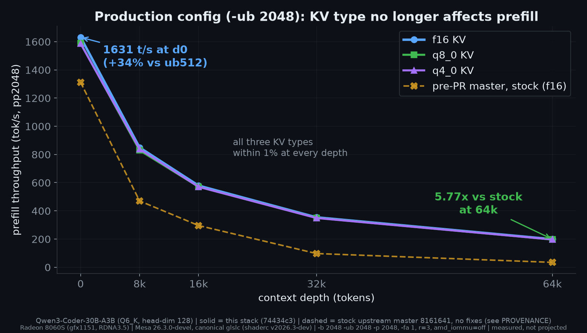

# Strix Halo llama.cpp flash-attention + MoE fixes - evidence pack

Measured evidence for a set of Flash-Attention and MoE-prefill fixes for llama.cpp on
AMD Strix Halo (gfx1151 / RDNA3.5). Each fix is independent and upstreamable on its own;
this repo is the reproducible measurement behind them, taken on the **latest** GPU driver
and llama.cpp master so the numbers cannot be waved away as a stale toolchain.

Narrative/write-ups are intentionally left out. This is a data pack: the exact toolchain is
pinned below. The front-page "at a glance" table, the ceiling matrix, the ubatch tables, the
vs-public section and charts 01-05 all trace to raw `llama-bench` files vendored under
`results/` (including `kvoff/`, `full-q4-results/`, `stack-ab-results/`, `finalize/`).

These claims are **not** backed by a file in this repo:

- The HIP/ROCm decode figures (fix 2). Raw `llama-bench` dumps exist outside this repo. The
  RTX 3070 cross-vendor pair has no raw file at all; it rests on a report from the 3070 owner.
- The two `test-backend-ops` counts (FLASH_ATTN 6000/6000, MUL_MAT_ID 790/790). Logs exist
  outside this repo. The FLASH_ATTN_EXT gate snapshot has no surviving log at all.
- The per-flag mmid contributions in the README table. Env-gated A/B runs recorded in branch
  commit messages and handoff notes, not in a results file.
- The `amd_iommu=off` figure, measured against an off-vs-on control that is not vendored.
- The RADV-vs-ROCm figures in the "Superseded" note, from the 2026-07-30 same-head matrix.
- The statement that stock at base `ff067f7` benches identical to master on the 35B ub2048
  shape. No such measurement has been located; it is unverified.
- The third-party reference points (kyuz0, strix-halo-guide, strixhalo.wiki). Other people's
  published numbers, cited by URL; no local copy is kept.

The op-level FA probes (29.8 vs 63.1 ms at hd128, 68.3 vs 152.7 ms at hd256, and the 72.6% FA
graph share) are now vendored under `results/op-probes/`. See PROVENANCE.txt for capture
conditions.

See **[BRANCHES.md](../BRANCHES.md)** for the per-branch fix inventory (which clean branch carries which
fix, for independent upstreaming) and the mmid config-flag taxonomy (the one real fix vs the marginal
config-tweaks).

## Charts




## The machine

- Framework Desktop, Ryzen AI Max+ 395 (Strix Halo), Radeon 8060S iGPU (gfx1151 / RDNA3.5)
- 64 GB LPDDR5X unified memory, ~256 GB/s. Capacity-rich, bandwidth-poor: it fits large
  models and long KV, but streaming that KV is the bottleneck. That is exactly the regime
  where quantized KV should win, and where these fixes matter.

## Toolchain (pinned)

| Component | Version |
|---|---|
| GPU driver | Mesa **26.3.0-devel** (`git-d18d598e`, 2026-07-25), RADV, built locally |
| libdrm | 2.4.133 (built as a local prefix for the Mesa build) |
| Vulkan headers | 356 |
| Shader compiler | shaderc **v2026.3-dev** (`49a8724d`) - NOT the distro's 2023.8 glslc |
| llama.cpp (PRE) | master `fb92d8f` (2026-07-25) |
| llama.cpp (POST) | `d808751` = `fb92d8f` + the 5 PR #25494 commits + `6e2b7ea` (all-quant transpose) rebased onto that stack. Tagged `benchmarks-POST-d808751` in the build tree; it is reachable from no branch. |

The custom Mesa is used only for these runs via `VK_ICD_FILENAMES`; the system Mesa (25.2.8)
is left untouched. The shader-compiler pin matters: building against the 3-year-old distro
`glslc` compiles successfully but emits different SPIR-V, producing numbers that are not
comparable to a current toolchain. All arms here use the same v2026.3-dev glslc.

### Benchmark protocol

```
llama-bench -ngl 99 -fa 1 -b 512 -ub 512 -p 512 -n 32 -d 0,4096,16384,32768,65536 -r 3 -o md
```

The `ub2048_*` results (production-config section below) use a second protocol:

```
llama-bench -ngl 99 -fa 1 -b 2048 -ub 2048 -p 2048 -n 0 -d 0,8192,16384,32768,65536 -r 3 -o md
```

- GPU services (llama-swap, ComfyUI) stopped for the whole run; ~60 GiB free.
- q8: `-ctk q8_0 -ctv q8_0`; q4: `-ctk q4_0 -ctv q4_0`; f16: default.
- pre/post arms interleaved adjacently per quant type, 20 s settle between arms, plus a
  start and end f16 canary to bracket window stability.
- `pp512` = prefill throughput at the given context depth; `tg32` = decode throughput at depth.

## The fixes

### 1. Vulkan: dequantize q8_0 KV once in the coopmat1 FA kernel (PR #25494) - prefill

**What it does.** The coopmat1 Flash-Attention path re-dequantized quantized K/V on every
FA invocation. This dequantizes q8_0 K/V **once** into a transposed, contiguous f16 scratch
and reuses it, which also fixes the strided-read penalty on the KV layout. Net effect is on
**prefill at depth**: the deeper the context, the more the one-time dequant amortizes.

- Scope in the PR: **q8_0 only**.
- Branch: `Nathanw1014/llama.cpp` `vulkan-coopmat1-fa-dequant-transpose` (also in `strix-halo-fa-fixes`).
- Status: **in-flight upstream PR #25494**.
- Evidence: the q8 PRE-vs-POST columns in the matrix below (this repo, latest stack).

### 2. HIP/ROCm: dequantize KV on load in the tile FA kernel (decode)

**What it does.** On CUDA/HIP the quantized-decode path uses the `vec` kernel, which
dequantizes each KV element once **per GQA query head** (gqa_ratio× redundant work; 8x on
Qwen3-Coder-30B). This teaches the `tile` kernel to dequantize KV on load into its LDS tile
and routes quantized decode there, so KV is dequantized once and reused across the batched
GQA heads. Same idea as #25494, opposite backend and opposite half of the session (decode,
not prefill). The two are complementary, not overlapping.

- Branch: `Nathanw1014/llama.cpp` `fa-tile-dequant-on-load` (also in `strix-halo-fa-fixes`).
- Status: **public branch, testable now**; upstream PR not yet opened (independent of #25494, different backend).
- Correctness: `test-backend-ops` FLASH_ATTN 6000/6000, after first closing an upstream test
  gap (quantized KV had zero coverage at head-dim 128 / gqa_ratio 8, the common real shape).
  The receipt is from branch `reb26046-verify` (the same three commits rebased onto post-#26046
  master `fb92d8f`), not from `fa-tile-dequant-on-load` itself.
- Measured (separate ROCm build, so read the deltas not the absolutes; built with
  `-DGGML_HIP_ROCWMMA_FATTN=OFF`, matching Lemonade's published llamacpp-rocm workflow at the
  time - moot since upstream #26046 merged 2026-07-24 and deleted that path),
  Qwen3-Coder-30B-A3B Q6_K weights, q8_0 KV, tg32:
  - d32k: 16.72 -> 38.12 (**+128%**), beats f16 (31.99) by 1.19x
  - d64k:  8.94 -> 29.69 (**+232%**), beats f16 (21.37 +/- 1.96) by 1.39x. That f16 comparator
    is the only headline cell here with >2% stddev.
  - Cross-vendor: the branch **as shipped is a no-op on tensor-core NVIDIA**. With a local
    diagnostic patch relocating the routing condition into the turing-mma quantized branch, an
    RTX 3070 (Ampere) shows +43.9% @32k and +95.8% @64k on Llama-3.2-1B, so the mechanism is
    not a gfx1151 quirk. The same run shows -15% on GQA-7 Qwen2.5-7B @16k and -77% prefill
    @32k, so the routing is not a free win on that hardware.

### 3. Vulkan: mmid grouped-GEMM row-list prepass (MoE prefill)

**What it does.** `MUL_MAT_ID` (MoE expert routing) ran an O(experts x tokens) expert-ID scan
in every workgroup. A prepass builds row lists (prefix-sum counts -> offsets -> scatter packed
rows) so the scan happens once. That is the real fix: **+8 to +11% end-to-end, depth-dependent**
(+11.2% at d0, +8.2% at d16384 - `results/finalize/rowlists_{off,on}.md`; an earlier
2026-07-14 window on a different base and q8 KV measured +8.4%). Smaller waste-removals
stack on top (scache, bm64, smalln); two knob-tweaks (wave32, f16b) are marginal-to-noise and
kept env-gated. The kernel is DRAM-bandwidth-bound (per-expert weight streaming), so removing
wasted work beats the wall while wave-size/tile knobs cannot.

- Branch: `Nathanw1014/llama.cpp` `mmid-fullstack`. Env-gated; defaults undecided.
- Correctness: 790/790 `MUL_MAT_ID` (2026-07-16 suite, run on the system Mesa 25.2.8 - not the
  26.3.0-devel pinned above). The suite has since grown; the current stack is 863/863.
- Measured on this stack (the ceiling matrix below, the **mmid stack** isolated via env toggle -
  the toggle switches `ROWLISTS+SMALLN+BM64+WAVE32` together, not rowlists alone), pp512:
  - Qwen3.6-35B-A3B: +15% at d0, tapering to +7% at 64k (the MoE-heavy model where mmid pays)
  - Qwen3-Coder-30B-A3B: near-zero at depth (+4% at d0, +0% at 64k); its 128-expert/top-8
    routing already fits the tiles natively

### (experimental) all-quant dequant-transpose - extends #25494 to q4/q5

Commit `6e2b7ea` extends the #25494 dequant-once path to q4_0/q4_1/q5_0/q5_1 (and iq4_nl).
It is **not** part of PR #25494 (which is q8-only); it is included here to measure q4 **with**
dequant-once (the `q4 dequant-once` column below) and it feeds the max-performance branch.

- Correctness on the latest stack (`strix-halo-vulkan` @ `54d76da`): FLASH_ATTN_EXT passes
  **5105/5105**, including all 340 iq4_nl cases. iq4_nl previously failed with ERR=inf on the
  pinned `d808751` build below; the routing fix (`8929240`) and its tests (`bb4002a`) closed that.

### 4. Vulkan: contiguize strided f16 KV before FA (GGML_VK_FA_KV_CONTIG) - prefill at depth

**What it does.** The KV cache stores all heads interleaved per token, so the K/V view
reaching Flash-Attention has each head's rows strided (256B useful out of every 1KB on
Coder-30B). The coopmat1 kernel loads K/V tiles straight from global memory, and on that
stride a 16x16 tile touches 16 cache lines instead of 4: the FA op measures 29.8ms
contiguous vs 63.1ms on the cache layout (two invocations a day apart; the hd256 pair in the
stride-tax probe below is a single-process A/B, and both dumps are in
`results/op-probes/`). Quantized KV never hit this because the
dequant-once scratch (fix 1) already writes per-head-contiguous f16 as a side effect; f16 KV
skipped that path and was the only format still paying the strided loads. This fix routes
strided f16 K/V through the same scratch via a pure copy shader (no dequant), engaged only
for prefill (`neq1 >= 64`) and only when the rows are actually strided. Decode is untouched.

- Scope: **f16 KV, prefill only**; **on by default** since `3957182` (`GGML_VK_FA_KV_CONTIG=0` opts out).
- Branch: `Nathanw1014/llama.cpp` `strix-halo-vulkan`, commits `442d7df` (fix) + `74434c3` (tests) + `3957182` (default-on).
  Upstream-prep: `vulkan-fa-f16-kv-contig` (env-free, stacked on the #25494 branch since it extends that scratch infra).
- Status: **public branch, testable now**; upstream PR queued behind #25494.
- Evidence: `results/contig_coder30b_*` vs `results/post_coder30b_f16` (section below).
- Headline: f16 pp512 @ d65536 goes **70.6 -> 190.0 t/s (2.69x)**; tg32 unchanged at every depth.

### 5. Vulkan: route non-native FA K/V types through the dequant-once path (iq4_nl correctness)

**What it does.** iq4_nl has no native FA shader on the scalar/coopmat1 paths; outside the
dequant-once path the shader silently reads garbage, which is how the iq4_nl+sinks
FLASH_ATTN_EXT failures (ERR=inf, excluded from the correctness gate above) escaped.
`ggml_vk_fa_kv_native()` becomes the single source of truth for native K/V types; non-native
types are forced through the dequant-once path and supports_op mirrors every hard gate so
admission and dispatch always agree.

- Scope: correctness only, no perf claims; commit `8929240` on `strix-halo-vulkan`
  (`1abdd92` resolves only in the archived `strix-halo-vulkan-ff067f7`).
- Status: fix and test cases both landed (`8929240`, `bb4002a`); FLASH_ATTN_EXT is 5105/5105.
- Caveat: upstream master `8161641` ("vulkan: add iq4_nl support back to FA", #24585, 2026-07-28)
  touches the same area and must be reconciled before any upstream submission.

## Correctness gate (this stack)

`test-backend-ops -o FLASH_ATTN_EXT` on the POST build (2026-07-26, v2026.3-dev glslc): all
f16 / q8_0 / q4_0 / q4_1 / q5_0 / q5_1 cases pass; 84 iq4_nl cases fail (not used by any arm
here). **Superseded:** on the current `strix-halo-vulkan` tip the suite is 5105/5105 with
iq4_nl green - see fix 5. The backing artifact for this snapshot does not name the driver, so
it is not attributed to a specific Mesa build.

## The matrix

Both models are A3B MoE. Qwen3-Coder-30B-A3B = Q6_K_XL, head-dim 128, gqa 8, a pure
transformer. Qwen3.6-35B-A3B = Q5_K_XL, head-dim 256, gqa 8, and a **gated-delta-net hybrid:
only 10 of its 40 blocks run attention at all**, so FA work is diluted roughly 4x on that
model - which is why its curves differ in shape, not only in head-dim. All values t/s, r=3.
"post"/"deq-once" = dequant-once ON; "pre"/"base" = OFF (plain master). Start-vs-end f16
canary: prefill within 0.8% at every depth; decode within 0.5% except d0 (+2.3%) and d16384 (-1.8%).

> **Re-validated on `amd_iommu=off` (0–64k, 2026-07-26).** The full matrix was re-run on a clean iommu-off
> box; start/end prefill canaries agreed within 0.9%, decode canaries within 3.9%. The headline reproduces:
> Coder-30B prefill @64k stock-f16 71.9 → q4 190 (**2.64x**) / q8 191 (**2.66x**); 35B decode @64k **+17%**
> on the all-fixes arm (+18-20% with mmid off, or on the stock-q4 arm). The IOMMU itself
> accounts for only **~+3–5% prefill, ~neutral decode** (measured off-vs-on, same build), so the detailed
> per-depth tables below — from the original iommu-on run — sit a few percent low but are unchanged in shape
> and conclusion. Metric note: the repo graphs are **pp512**; the "vs public" section is **pp2048** to match
> kyuz0, so their prefill percentages differ by construction (pp512 @64k = +9% on the 35B Q4_K_XL).

### Headline

- **q4 gets dequant-once too, and it lands the same win as q8.** Coder-30B prefill at 64k:
  q4 baseline 125.75 -> **182.41 (+45%)**; q8 baseline 125.34 -> 183.75 (+47%). q4-with-dequant-once
  matches q8-with-dequant-once at every depth (both dequantize into the same f16 scratch, so the
  FA cost converges).
- **Dequant-once removes the quantized-KV prefill penalty, and the gain grows with depth.** At
  head-dim 128 (Coder-30B) quantized prefill goes from roughly f16 to **2.6x f16** at 64k. At
  head-dim 256 (35B) it goes from ~17% below f16 up to **f16 parity**.
- **Decode is untouched by the fix** (q8/q4 pre == post within noise): the change is prefill-only.
  Quantized decode already beats f16 at depth on RADV via native GQA batching (Coder-30B 64k:
  q8 +36%, q4 +41%; 35B 64k: q8 +13%, q4 +17%).
- Net: on this box **q4_0 KV is the best long-context choice** - smallest footprint, fastest
  decode, and (with dequant-once) prefill equal to q8.

### Prefill, pp512 (t/s)

**Qwen3-Coder-30B-A3B (head-dim 128)** - the strongly-affected shape:

| depth | f16 | q8 pre | q8 post | Δ q8 | q4 base | q4 deq-once | Δ q4 | q8post / f16 |
|---:|---:|---:|---:|---:|---:|---:|---:|---:|
| 0 | 1128.18 | 1102.36 | 1117.15 | +1% | 1096.29 | 1113.15 | +2% | 0.99x |
| 4096 | 807.28 | 738.36 | 834.38 | +13% | 728.39 | 825.83 | +13% | 1.03x |
| 16384 | 370.73 | 372.81 | 481.31 | +29% | 367.23 | 484.23 | +32% | 1.30x |
| 32768 | 198.98 | 225.79 | 308.33 | +37% | 223.12 | 313.01 | +40% | 1.55x |
| 65536 | 70.64 | 125.34 | 183.75 | +47% | 125.75 | 182.41 | +45% | 2.60x |

**Qwen3.6-35B-A3B (head-dim 256)** - dequant-once brings quant up to f16 parity:

| depth | f16 | q8 pre | q8 post | Δ q8 | q4 base | q4 deq-once | Δ q4 | q8post / f16 |
|---:|---:|---:|---:|---:|---:|---:|---:|---:|
| 0 | 1003.29 | 962.13 | 999.17 | +4% | 996.62 | 1000.51 | +0% | 1.00x |
| 4096 | 902.17 | 873.73 | 914.44 | +5% | 838.86 | 903.93 | +8% | 1.01x |
| 16384 | 768.82 | 691.65 | 765.47 | +11% | 673.01 | 761.27 | +13% | 1.00x |
| 32768 | 631.76 | 546.52 | 623.88 | +14% | 544.24 | 630.80 | +16% | 0.99x |
| 65536 | 469.40 | 388.11 | 464.86 | +20% | 381.73 | 465.09 | +22% | 0.99x |

### Decode, tg32 (t/s)

Decode is prefill-fix-neutral (q8/q4 pre == post within noise), so only the post arms are shown.
Quantized decode beats f16 at depth via RADV's native GQA batching.

**Qwen3-Coder-30B-A3B (head-dim 128)**

| depth | f16 | q8 | q4 | q8 / f16 | q4 / f16 |
|---:|---:|---:|---:|---:|---:|
| 0 | 66.78 | 68.31 | 66.14 | 1.02x | 0.99x |
| 16384 | 45.00 | 49.48 | 52.15 | 1.10x | 1.16x |
| 32768 | 33.71 | 41.28 | 42.92 | 1.22x | 1.27x |
| 65536 | 22.68 | 30.90 | 32.03 | 1.36x | 1.41x |

**Qwen3.6-35B-A3B (head-dim 256)**

| depth | f16 | q8 | q4 | q8 / f16 | q4 / f16 |
|---:|---:|---:|---:|---:|---:|
| 0 | 58.20 | 58.56 | 58.34 | 1.01x | 1.00x |
| 16384 | 51.71 | 55.09 | 54.78 | 1.07x | 1.06x |
| 32768 | 47.85 | 51.57 | 50.18 | 1.08x | 1.05x |
| 65536 | 41.45 | 46.81 | 48.32 | 1.13x | 1.17x |

## The ceiling: all fixes stacked (max prefill + decode)

The matrix above isolates the in-flight PR (dequant-once) on latest master. This section stacks
**everything** for maximum throughput: dequant-once + q4 transpose + the mmid MoE-prefill stack
(`ROWLISTS+SMALLN+BM64+WAVE32`; F16B was left OFF **for these runs** — see note below), built on
the fix base `5c3a586` and compared against stock `5c3a586`, same glslc / same driver. Start-vs-end
f16 canary drifted <1% at every point.

Column key: `stock f16` and `stock q4` = plain 5c3a586. `+FA fixes` = dequant-once + q4 transpose,
mmid off. `CEIL` = + mmid on. `mmid adds` = CEIL vs +FA-fixes (isolates mmid).

> **Note on F16B (updated 2026-07-27).** These runs predate the fix and left `GGML_VK_MMID_F16B`
> off. The abort was root-caused to a missing `Q2_0` f16-B pipeline — an experimental type that only
> `test-backend-ops` reaches and no real GGUF uses — not a Mesa 26.3 driver bug. It is fixed, and the
> shipped `vulkan/_run` wrapper now enables F16B **by default**. So these numbers are a slight
> *under*-statement of the current build on models where F16B helps (small gain on the 35B, neutral
> on Coder-30B).

### Prefill pp512 (t/s) - Qwen3-Coder-30B-A3B (hd128)

| depth | stock f16 | stock q4 | +FA fixes (q4) | CEIL (q4) | CEIL (q8) | mmid adds | total vs stock f16 |
|---:|---:|---:|---:|---:|---:|---:|---:|
| 0 | 1131.64 | 1099.14 | 1114.13 | 1156.07 | 1160.21 | +4% | +2% |
| 4096 | 810.40 | 729.43 | 827.90 | 852.30 | 853.11 | +3% | +5% |
| 16384 | 371.22 | 367.76 | 483.45 | 489.04 | 489.52 | +1% | +32% |
| 32768 | 202.05 | 224.31 | 310.23 | 314.56 | 313.56 | +1% | +56% |
| 65536 | 69.78 | 125.74 | 184.64 | 185.37 | 186.26 | +0% | **+166% (2.66x)** |

### Prefill pp512 (t/s) - Qwen3.6-35B-A3B (hd256)

| depth | stock f16 | stock q4 | +FA fixes (q4) | CEIL (q4) | CEIL (q8) | mmid adds | total vs stock f16 |
|---:|---:|---:|---:|---:|---:|---:|---:|
| 0 | 992.05 | 997.02 | 1027.92 | 1183.63 | 1183.34 | **+15%** | +19% |
| 4096 | 900.44 | 876.89 | 931.36 | 1070.09 | 1067.39 | +15% | +19% |
| 16384 | 759.99 | 693.90 | 779.54 | 866.66 | 870.85 | +11% | +14% |
| 32768 | 628.41 | 555.04 | 629.06 | 703.52 | 696.77 | +12% | +12% |
| 65536 | 462.91 | 385.36 | 470.41 | 503.68 | 506.51 | +7% | +9% |

### Decode tg32 (t/s), CEIL vs stock f16

| depth | Coder-30B f16 | Coder-30B CEIL q4 | ratio | 35B f16 | 35B CEIL q4 | ratio |
|---:|---:|---:|---:|---:|---:|---:|
| 0 | 67.42 | 66.76 | 0.99x | 58.16 | 58.47 | 1.01x |
| 32768 | 33.68 | 42.69 | 1.27x | 47.32 | 52.09 | 1.10x |
| 65536 | 22.69 | 32.56 | 1.43x | 40.71 | 48.47 | 1.19x |

**mmid is model-dependent.** It is a large win on the 35B (+15% shallow, +7-12% at depth) and near-zero
on Coder-30B (+4% shallow, +0% deep): Coder-30B's 128-expert/top-8 routing already fits the tiles
natively (mean per-expert n ~= 32 = the tile width), so there is little redundant expert-scan to remove;
the 35B carries the tile-occupancy waste that mmid's row-list prepass eliminates. On Coder-30B the deep
prefill win is essentially all dequant-once (stock f16 70 -> all-fixes q4 185 = 2.66x at 64k).

## f16 catches up: the KV-CONTIG fix (2026-07-28, build 74434c3)

The tables above told a "use quant KV to rescue deep prefill" story: stock f16 collapsed to
70 t/s at 64k while q4/q8 held 185. Fix 4 removes the collapse at its source, so f16 no
longer needs rescuing. Same protocol, same driver as the ceiling runs; raw dumps in
`results/contig_coder30b_*`.

### Prefill pp512 (t/s) - Qwen3-Coder-30B-A3B, f16 KV

| depth | published f16 (post) | 74434c3 f16 (contig) | change | contig q8 | contig q4 |
|---:|---:|---:|---:|---:|---:|
| 0 | 1128.18 | 1219.24 | +8% | 1214.73 | 1203.19 |
| 4096 | 807.28 | 919.89 | +14% | 898.68 | 895.91 |
| 16384 | 370.73 | 511.42 | +38% | 505.66 | 503.39 |
| 32768 | 198.98 | 325.88 | +64% | 322.63 | 322.32 |
| 65536 | 70.64 | 190.03 | **+169% (2.69x)** | 191.28 | 189.87 |

All three KV types now land within 1% of each other at every depth: **KV quantization is no
longer a prefill-speed decision on this stack**, only a memory / decode-bandwidth one. Decode
is untouched by design: every tg32 delta vs the published tables is neutral-to-positive and
within +4% (largest: q4 @d65536 +4.0%, q8 @d16384 +3.2%, q8 @d32768 +3.2%) - the same build
drift discussed below, not a decode change (`contig_*` files include the tg32 rows). The small
q8/q4 prefill gains over the published CEIL numbers (+2 to +5%) are build drift from the base
rebase and mmid flag defaults, not this fix (per-flag decomposition to follow).

### Prefill pp512 (t/s) - Qwen3.6-35B-A3B (hd256), vs pre-PR master

Same protocol on the 35B. Baseline = stock upstream master `8161641` (2026-07-28), canonical
glslc, freshly measured (`results/prepr_qwen35b_f16.md`); "this stack" = build 74434c3
(`results/` has all three KV arms). hd256 f16 never collapsed the way hd128 did, so the win
here is broad rather than dramatic - and it holds without quantizing the KV.

| depth | pre-PR master f16 | this stack f16 | change | this stack q8 | this stack q4 |
|---:|---:|---:|---:|---:|---:|
| 0 | 1053.14 | 1271.48 | +21% | 1274.12 | 1272.86 |
| 4096 | 951.41 | 1141.86 | +20% | 1147.80 | 1153.24 |
| 16384 | 800.94 | 923.34 | +15% | 927.52 | 927.42 |
| 32768 | 658.11 | 737.65 | +12% | 730.28 | 742.09 |
| 65536 | 474.22 | 525.50 | +11% | 524.44 | 528.26 |

These are the `scachefix_qwen35b_*` files (build `146fb73`, which disables a scale cache that
had regressed on this model - see the scache note below). The earlier capture on `74434c3`
(`contig_qwen35b_*`) is kept for the before/after.

Decode is flat vs master on f16 (+/-1.5% at every depth); quantized KV keeps its established
decode advantage at depth (tg32 @ d65536: f16 41.6, q8 47.1, q4 49.2 - the KV-bandwidth
effect, unrelated to this fix). Coder-30B vs the same fresh master baseline
(`results/prepr_coder30b_f16.md`): stock still collapses to 72.2 pp512 @ d65536, so the fix's
headline stands at **2.63x vs current master** (190.0 vs 72.2).

## Production config: ub2048 (recommended on Strix)

Everything above uses the ub512 protocol for comparability with the public corpus. But the
physical batch default (`-ub 512`) leaves real prefill on the table on Strix with MoE models:
at ub512 each of Coder-30B's 128 experts sees only ~32 rows per ubatch, and the expert GEMMs
are dominated by streaming weights in. At ub2048 each expert gets ~128 rows and the same
weight traffic feeds 4x the work. Cost is extra GTT for the larger compute buffers: measured
**+1.1 GiB on Coder-30B going ub1024 -> ub2048**, which a 64 GiB+ Strix box does not notice.
(The ub512 -> ub2048 delta has never been measured on this model. An earlier `~1.6 GiB` figure
here was Laguna-S-2.1 117B UD-Q3_K_XL, a ~50 GiB model, and did not belong in this paragraph.)

**Recommendation: run `-b 2048 -ub 2048` on Strix Halo for Coder-30B-class MoE models**
(hd128, small-expert A3B; it is the config the maintainer's own server runs). Isolated at the
same prompt length, ubatch 2048 alone is worth **+39%** on Coder-30B (pp2048 d0: 1170 @ ub512
-> 1631 @ ub2048; `results/iso_ub512_pp2048_coder30b_f16.md`). It is NOT universal: on the
35B the same isolation measures **-12%** at d0 (1180 -> 1035), so leave the 35B at the
default shallow and prefer ub2048 only for deep-context work there (at d65536 it wins:
541 vs 297 stock). Keep 512 also if you serve many concurrent streams and care about decode
latency spikes during long prefill chunks: the ubatch is the scheduling quantum. Decode is
unaffected by ubatch either way (tg32 58.3 @ ub2048 vs 57.3 @ ub512, same build - measured,
`results/ub2048_contig_qwen35b_f16.md`). Prompts shorter than the ubatch are one chunk
either way and see no difference.


### Prefill pp2048 @ ub2048 (t/s) - Qwen3-Coder-30B-A3B, build 74434c3

| depth | f16 | q8_0 | q4_0 | ROCm reference (f16) |
|---:|---:|---:|---:|---:|
| 0 | 1630.88 | 1589.03 | 1585.78 | 1475.41 |
| 8192 | 849.26 | 829.23 | 838.18 | 953.78 |
| 16384 | 578.99 | 570.37 | 570.44 | 677.83 |
| 32768 | 354.02 | 349.95 | 349.09 | 412.87 |
| 65536 | 198.80 | 196.28 | 196.48 | 225.99 |

d0 prefill gains +39% over the same build and prompt at ub512 (1631 vs 1170). The ROCm column is a
reference point, not a toolbox build: upstream llama.cpp `571d0d5`, HIP, rocWMMA off, ROCm
7.2.4 (see PROVENANCE; `results/ub2048_rocm_coder30b_*`, q8/q4 files there too - ROCm prefill
is KV-type-insensitive like ours). Vulkan leads at d0 by ~11%; ROCm leads at depth by 12-17%
(a coopmat1 kernel-structure residual, under investigation). rocWMMA-ON HIP builds are far
slower at depth than rocWMMA-off and should not be used as the comparison point.

> **Superseded for RADV-vs-ROCm claims.** This column pairs two builds from different upstream
> heads. The 2026-07-30 matrix runs both backends from the same head (`8161641`) under a
> stabilized protocol. There, **on Coder-30B**, the shipped stack (`bb4002a` - what the v0.1
> tarball and the container carry) still trails ROCm by 10-15% at d8192-d32768; the four FA
> changes committed 2026-07-30 (`e11cafa`, `40f85eb`, `dfb619c`) close that and lead ROCm by
> +3.0 to +4.4% at those depths and by +14% at d0, on all three KV types. **On the 35B, ROCm
> still leads d0 by ~5.6%**, d8192 is a tie, and RADV leads only from d16384. So a
> build-from-source reader gets the leading arm; a tarball or container reader does not yet.
> Prefer that matrix for any RADV-vs-ROCm statement; this column is kept because graph 05 is
> drawn from it.

### Prefill pp2048 @ ub2048 - Qwen3.6-35B-A3B (and the scale-cache regression)

| depth | this stack f16 | this stack q8 | stock master f16 | f16 vs stock |
|---:|---:|---:|---:|---:|
| 0 | **1296.5** | 1288.9 | 1140.7 | 1.14x |
| 8192 | **993.9** | 1095.8 | 979.3 | 1.01x |
| 16384 | **945.3** | 958.5 | 857.0 | 1.10x |
| 32768 | **766.5** | 764.4 | 595.8 | 1.29x |
| 65536 | **541.1** | 539.3 | 297.0 | **1.82x** |

An earlier capture on build `74434c3` (`ub2048_contig_qwen35b_*`, kept in results/) showed
stock master AHEAD 0.91x at shallow depth here. That deficit was initially suspected to be
base drift and turned out to be a regression in this stack: the mmid q5_K scale cache
(added 2026-07-14 as a win) had been obsoleted by later tile changes and measured -20% on
this model at ub2048 and -4% at the standard protocol. Build `146fb73` disables it. (Base
drift was ruled out on reasoning, not on a measurement of this shape - no `ff067f7` bench of
the 35B at ub2048 exists, so treat that step as unverified.) With that fix the stack leads stock master on
the 35B at every depth and both protocols. tg32 unchanged throughout, and measured
ubatch-invariant (58.0 @ ub2048 vs 58.7 @ ub512, same build). Raw: `results/ub2048_scachefix_qwen35b_*`,
`results/ub2048_prepr_qwen35b_f16.md`.

### Drift note: where the +2-5% over the published q8/q4 tables comes from

Measured decomposition (Coder-30B q8, pp512 d0; `results/drift_coder30b_q8_*`): upstream base
refresh `5c3a586` -> `ff067f7` = **+3.2%**, F16B-on-by-default = **+1.2%**, M128 = **+0.3%**.
(Earlier notes labelled that base `b10133`; per PROVENANCE that was a stale label from a
previous rebase and the stack base is `ff067f7`.)
The same base-staleness effect, larger, is what the 35B ub2048 table above shows against
today's master.

### hd256 stride-tax probe

The op-level strided-load tax is NOT hd128-specific: at 35B-class geometry (hd256, 4 KV
heads, kv=10240, nb=2048) the FA op measures 68.3 ms contiguous vs 152.7 ms on the cache
layout (2.24x; hd128 measures 2.1x). Raw: `results/op-probes/hd256-probe.txt`, a single-process
A/B. The model-level difference between Coder-30B (2.63x end-to-end) and the 35B (+11% at
depth) is FA's share of the graph, not kernel immunity at hd256: FA is **72.6%** of the
pp2048@d8192 graph on the tiny-FFN A3B Coder (`results/op-probes/vk-perflog.txt`, measured
with the mmid stack on and contiguize off). The 35B share was **not measured**; it is expected
to be far lower because only 10 of its 40 blocks run attention.

## vs public data

The public Strix Halo corpus DOES report depth (correcting an earlier assumption) - but almost all of it
runs **f16 KV**. The cleanest public reference is kyuz0/amd-strix-halo-toolboxes (single box, raw JSON).
To compare cleanly we ran the SAME model at kyuz0's exact weight quant (Qwen3.6-35B-A3B UD-Q4_K_XL), so
the only variables are KV type + our fixes, not weights.

> **KV-type caveat on every third-party number in this section.** Neither kyuz0's schema nor the
> strixhalo.wiki page records a KV cache type. "f16 KV" for their runs is inferred from the
> `llama-bench` default, not stated by the source. The kyuz0 figures quoted below are their
> **RADV** column specifically (their matrix also carries ROCm 7.2, ROCm 6.4, ROCm-nightly and
> AMDVLK).

**Same box, same weights (UD-Q4_K_XL), stock f16 KV vs fixes + q4 KV (pp2048 / tg32, ub1024):**

| depth | prefill: stock f16 -> fixes q4 | decode: stock f16 -> fixes q4 | KV footprint |
|---:|---|---|---:|
| 32768 | 689 -> 746 (+8%) | 49.7 -> 55.2 (+11%) | 1/4 |
| 65536 | 465 -> 522 (+12%) | 42.6 -> 50.3 (**+18%**) | 1/4 |

**Cross-check vs kyuz0's published f16 (same model, Q4_K_XL):** our stock-f16 decode lands within ~1-2% of
kyuz0's (42.6 vs 43.2 @64k; 49.7 vs 49.2 @32k), so our baseline reproduces theirs and the comparison is
valid. That puts our q4 decode **+16% over kyuz0's f16 at 64k, at 1/4 the KV memory**.

Honest read: **+12% prefill and +18% decode vs stock f16 at matched weights, 1/4 the KV memory.** The decode
win cross-validates against public data. The prefill figure is the same-box A/B: our f16 prefill baseline
sits a bit below kyuz0's (a build/driver gap), so we do not claim a cross-box prefill win. Independent
corroboration that quant-KV beats f16 on decode at depth: the `strix-halo-guide` filled_kv_decode.csv
(35B @64k: f16 41.4 vs q4_0 51.3). Read that one as directional only - it is a different box
(Beelink GTR9 Pro, build b9010), different weights (UD-Q4_K_M, not Q4_K_XL) and a different
metric (`llama-server` eval_tps over n_predict=128, not a `llama-bench` tg32 point). The same
rows also show q4_0 with the slower total wall time (89.97s vs 73.52s) and lower prefill
(750.0 vs 931.9), which is the tradeoff this comparison omits.

The **2.6x prefill** figure is a *separate* claim: our own f16 -> quant on Qwen3-Coder-30B-A3B (hd128,
where dequant-once is strongest). There is no clean public depth counterpart for that model/config, so it
stands on the same-box pre/post above, not on a public comparison.

kyuz0 numbers: https://github.com/kyuz0/amd-strix-halo-toolboxes/blob/main/docs/results.json (RADV column, `-fa`;
the fetched meta lists builds b9187 and b9193 and the 35B rows do not say which, and record no KV type).

### 128k deep context — vs strixhalo.wiki (2026-07-26, iommu-off)

`strixhalo.wiki/AI/llamacpp-performance` publishes a Qwen3-30B-A3B (Q4_K_XL) run at `d130560`
(~128k) — the deepest public gfx1151 point. We ran our Coder-30B-A3B (same 30B-A3B class, hd128; heavier
Q6_K weights) at the exact same depth. The wiki page states "KV Cache: Not explicitly specified",
so the f16 label below is the `llama-bench` default inferred, not their claim:

**Prefill pp512 @ 128k (d130560):**

| build | KV | pp512 | vs our fixed |
|---|---|---:|---:|
| wiki RADV | f16 | 17.2 | **6.0x** slower |
| wiki ROCm | f16 | 40.6 | 2.5x slower |
| wiki ROCm rocWMMA-tuned | f16 | 51.1 | **2.0x** slower |
| ours, stock | f16 | 28.4 | our baseline |
| **ours, + fixes** | **q4 / q8** | **102.8 / 102.5** | — |

**Decode tg @ 128k:** wiki RADV 12.5 / ROCm-tuned 13.3 → ours q4 **22.5**. Not a like-for-like
ratio: the wiki column is **tg128** and ours is **tg32**, so no percentage is quoted here.

Full 128k curve (this box, iommu-off):

| model | stock f16 pp / tg | q4+fix pp / tg | q8+fix pp / tg |
|---|---|---|---|
| Coder-30B-A3B (Q6_K, hd128) | 28.4 / 13.9 | **102.8 / 22.5** | 102.5 / 20.9 |
| Qwen3.6-35B-A3B (Q5_K, hd256) | 297.7 / 33.1 | 325.3 / 42.0 | 326.2 / 39.9 |

The hd128 prefill gain **grows with depth**: 1.6x @32k → 2.66x @64k → **3.6x @128k** (28.4 → 102.8, same box).
Even our stock f16 (28.4) tops the wiki's RADV f16 (17.2) — that part is the newer Mesa 26.3 + `amd_iommu=off`;
the fix is the 3.6x on top. Caveats: wiki weights are Q4_K_XL (lighter than our Q6_K, if anything favoring
them); deep-context prefill is KV-bound so weight quant matters little here; the 35B (hd256) barely moves (+9%),
as expected. Raw output: `benchmarks/results/` (Phase-3 `d130560` arms).

## Caveats / honesty

- Single measurement window per model. pp512 monotonicity and the start/end f16 canary are the
  in-window sanity checks; a tight r=3 stddev alone is not evidence of a clean window.
- This matrix is **Vulkan/RADV** (the #25494 prefill fix + RADV's native quantized decode).
  The HIP decode fix (section 2) is a different backend and a separate build; its numbers above
  are from their own windows and are labeled as such.
- The `q4 dequant-once` column uses the experimental `6e2b7ea`, not the shipping PR.

## Reproduce

Build Mesa (RADV, compute-only) against a local libdrm 2.4.133, build llama.cpp against the
v2026.3-dev glslc and `~/.local/include` headers, then run the matrix. The exact build/bench
scripts are under `scripts/` (`mesa_build.sh`, `llama_build2.sh`, `kv_matrix3.sh`), the pinned
toolchain and commit hashes are in `PROVENANCE.txt`, and raw `llama-bench` output is under
`results/` (one file per arm, plus start/end `canary*` for window stability).
